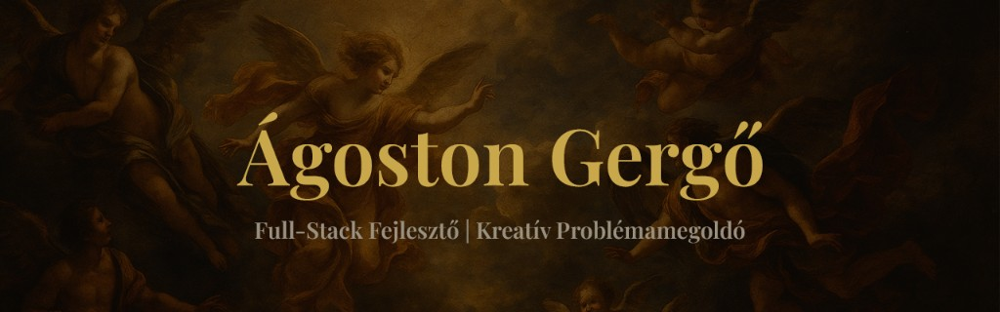

<div align="center">



<br/>

[](https://agostongergo.com)&nbsp;
[](https://linkedin.com/in/)

</div>

<div align="center">

</div>

<br/>

<div align="center">

```
 > whoami
 Ágoston Gergő — Full-Stack Developer, Óbudai Egyetem hallgató
 Szenvedélyem a letisztult, felhasználóközpontú digitális megoldások megalkotása.
```

</div>

<br/>

<!-- TECH STACK -->

<div align="center">


<br/><br/>

**Frontend**

<a href="#"></a>
<br/>
<sub>HTML &nbsp;·&nbsp; CSS &nbsp;·&nbsp; JavaScript &nbsp;·&nbsp; React</sub>

<br/>

**Backend**

<a href="#"></a>
<br/>
<sub>Node.js &nbsp;·&nbsp; C# &nbsp;·&nbsp; SQL</sub>

<br/>

**Eszközök**

<a href="#"></a>
<br/>
<sub>Git &nbsp;·&nbsp; Figma &nbsp;·&nbsp; Photoshop &nbsp;·&nbsp; Illustrator</sub>

</div>

<br/>

<!-- GITHUB STATS -->

<div align="center">

</div>

<br/>

<div align="center">


<br/><br/>

<a href="https://github.com/Puncsika">
  
</a>
&nbsp;&nbsp;
<a href="https://github.com/Puncsika">
  
</a>

<br/><br/>

<a href="https://github.com/Puncsika">
  
</a>

</div>

<br/>

<!-- ACTIVITY GRAPH -->

<div align="center">
  
</div>

<br/>

<!-- SNAKE -->

<div align="center">
  
</div>

<br/>

<!-- FOOTER -->

<div align="center">


<br/><br/>

<sub>Készítette <a href="https://agostongergo.com">Ágoston Gergő</a> — szenvedéllyel és precizitással.</sub>

</div>
